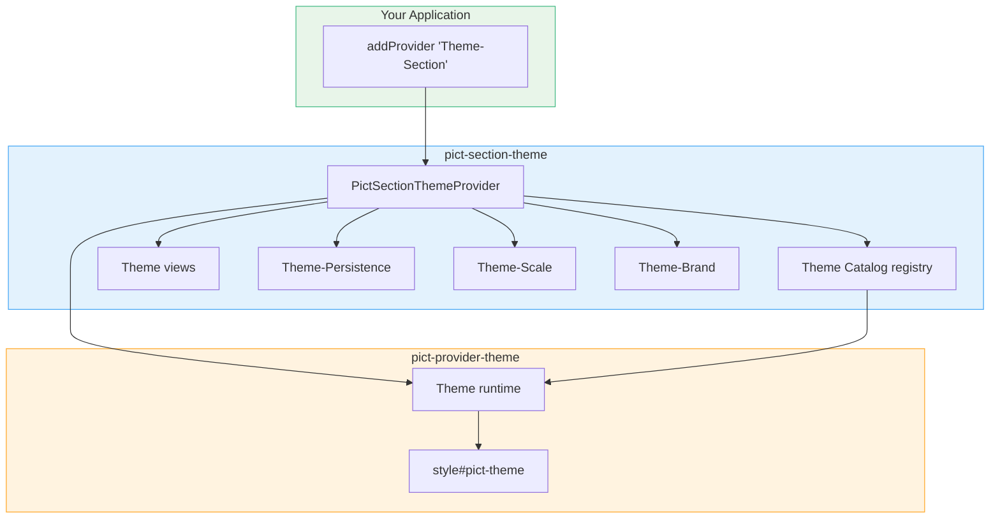
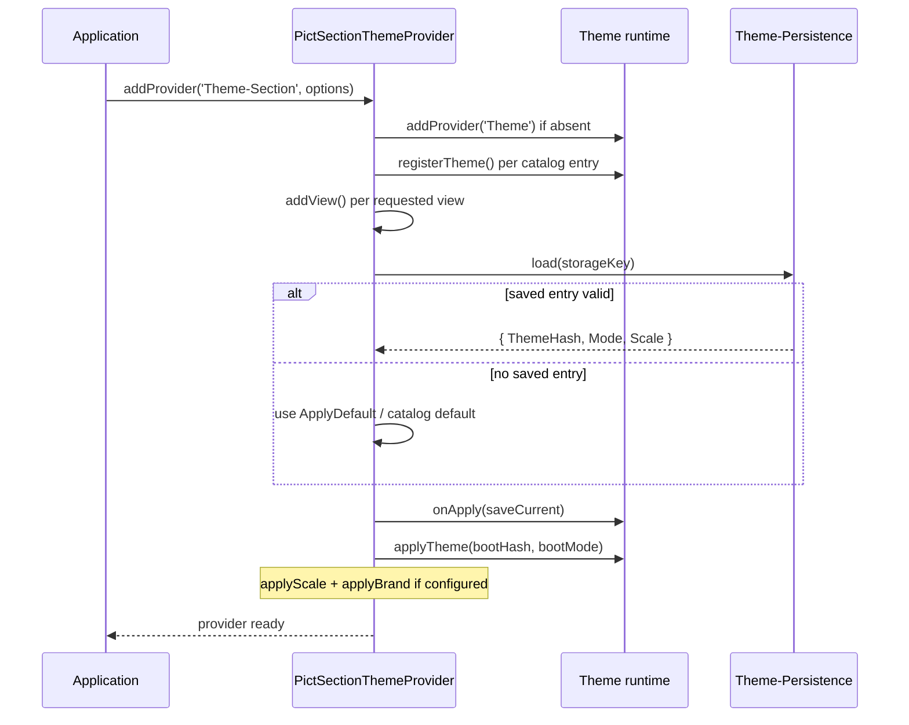

# Architecture

`pict-section-theme` is a thin section layer over the [pict-provider-theme](https://fable-retold.github.io/pict-provider-theme/) runtime. The runtime does the actual work of flattening theme tokens into CSS custom properties and applying modes; this module bundles the themes, ships the user-facing views, and adds the convenience concerns a runtime intentionally stays out of -- catalog registration, persistence, viewport scale, and brand.

## Components

The package entry point is `source/Pict-Section-Theme.js`. Its default export is the `PictSectionThemeProvider` class. The pieces it coordinates:

| Component | Source | Role |
|---|---|---|
| `PictSectionThemeProvider` | `Pict-Section-Theme.js` | Provider class; self-bootstraps the whole module on construction. |
| Theme catalog | `themes/_catalog.js` | A singleton registry of every bundled theme bundle, grouped by category. |
| Views | `views/PictView-Theme-*.js` | The picker, mode toggle, scale select, topbar button, and brand chrome. |
| Theme-Persistence | `Theme-Persistence.js` | Reads/writes the saved theme + mode + scale to `localStorage`. |
| Theme-Scale | `Theme-Scale.js` | Viewport zoom, independent of theme bundles. |
| Theme-Brand | `Theme-Brand.js` | Applies a host-supplied brand block as CSS custom properties. |
| Theme-Logo | `Theme-Logo.js` | The deterministic name -> SVG logo generator. Build-time only; not required by the runtime entry point. |



## Bootstrap Sequence

`addProvider('Theme-Section', options, libPictSectionTheme)` constructs the provider, which runs a synchronous bootstrap routine. The provider sets `AutoInitialize: false` deliberately -- it does its wiring in the constructor so consumers can use the views immediately after `addProvider` returns, rather than waiting for an async initialize chain.

The bootstrap performs these steps in order:

1. **Theme runtime.** If `pict.providers.Theme` is not already present, add [pict-provider-theme](https://fable-retold.github.io/pict-provider-theme/) (merging any `ProviderOptions`). Hosts that pre-register a custom runtime keep theirs.
2. **Catalog.** Unless `RegisterCatalog: false`, iterate the catalog and call the runtime's `registerTheme()` for every bundled theme.
3. **Views.** Add the requested views to `pict.views[...]`. `Views: null` adds all eight; an array subsets them by short-name. Per-view overrides come from `ViewOptions`. Views already registered under their hash are skipped.
4. **Persistence + initial apply.** Resolve the storage key, load any saved entry, and decide the boot theme/mode/scale. A valid saved entry wins over `ApplyDefault`. The runtime's `onApply` and the scale's `onChange` are both wired to a single save function so any change persists the full set.
5. **Fallback.** If nothing resolved a theme hash -- no `ApplyDefault`, no saved state, or a saved hash that has since been removed -- fall back to the catalog's canonical default (the entry flagged `IsDefault`). This guarantees the app always boots with CSS variables populated rather than painting with the intentionally-bland inline fallback colors.
6. **Brand.** If a `Brand` block was supplied, apply it last, so the brand views' first paint sees the CSS custom properties.



## Theme Catalog

The catalog (`themes/_catalog.js`) is a singleton `ThemeRegistry`. The bundled "starter set" is pre-registered at module load via static `require()` of each theme's JSON, so a browser bundler (browserify) can resolve and inline every bundle at build time.

Each entry has this shape:

```javascript
{
	Hash:      'retold-default',          // matches Bundle.Hash; used by the picker
	Bundle:    { /* theme JSON */ },        // ready for runtime.registerTheme()
	Category:  'Default',                   // grouping label for the picker UI
	IsDefault: true,                        // the canonical ecosystem default
	Source:    'starter'                    // 'starter' | URL | host tag
}
```

Bundled themes are grouped into categories -- verified from the starter set: `Default`, `App`, `Paired`, `Flow`, `Grey`, `Fun`, `Retro`, and `Debug`. The canonical default is `retold-default` (the only entry flagged `IsDefault: true`). `pict-default` is retained for backwards compatibility for consumers that opt in by hash, but is no longer the resolved default.

> The `Theme-Picker` groups its dropdown by these `Category` values. The full set of bundled theme hashes lives in `source/themes/_catalog.js`; this document does not duplicate the list because it changes as themes are added.

### Registry API

The registry singleton (exported as `Catalog`) supports:

- `register({ Hash, Bundle, Category?, IsDefault?, Source? })` -- add or replace a theme.
- `unregister(hash)` -- remove a theme; returns `true` if anything was removed.
- `get(hash)` / `has(hash)` -- direct lookup.
- `list()` -- snapshot of every entry, in registration order.
- `clear()` -- drop everything (mostly for tests).
- `registerFromURL(url, metadata)` -- async fetch + register a bundle from a URL (for a remote "theme garden").

Themes registered before `addProvider` runs are picked up automatically. Themes registered after must be pushed manually via `pict.providers.Theme.registerTheme(bundle)`.

The registry is also array-like for legacy callers: it exposes `.length`, is iterable, and supports numeric indexing (`Catalog[0]`). New code should prefer `list()` / `get()`.

## Persistence

`Theme-Persistence.js` stores one JSON object per scope under the `pict-section-theme:<scope>` key:

```javascript
localStorage["pict-section-theme:<scope>"] =
{
	Version:   1,
	ThemeHash: "retold-manager",
	Mode:      "dark",
	Scale:     1.25,
	SavedAt:   "2026-05-09T21:00:00.000Z"
}
```

- **Scope** is resolved in priority order: the host-supplied `PersistenceKey`, then `window.location.hostname`, then the literal `'default'` (Node, SSR, sandbox).
- **Version-tagged.** A schema-version mismatch is treated as "no saved entry", so the host's defaults take over.
- **Scale is optional.** Entries that pre-date the Scale field stay valid; `load()` returns `null` for an absent scale and the caller defaults to `1.0`.
- **Never throws.** Missing `localStorage` (SSR, private mode, blocked), quota-exceeded, parse errors, and version mismatches all degrade silently -- persistence failures must never crash the host's boot path.

## Scale

`Theme-Scale.js` is deliberately separate from theme bundles: viewport scale is a per-user preference, not a property of any theme. Applying a scale writes a single `<style id="pict-theme-scale">` element with two cooperating outputs:

- `html { zoom: <scale>; }` -- scales everything, including stylesheets that size in `px` (most Retold apps).
- `:root { --theme-scale: <scale>; }` -- exposed for stylesheets that want explicit `calc(... * var(--theme-scale))` sizing, and addressable from JS.

`applyScale(value)` clamps to the range `0.5`-`3.0` (`MIN_SCALE`-`MAX_SCALE`); non-finite values reset to `1.0` (`DEFAULT_SCALE`). It returns the actually-applied value after clamping, and is idempotent. The module exposes `getActive()` and an `onChange(callback)` listener that mirrors the runtime's apply listener, which is how persistence autosaves on scale change.

> The `DefaultScale` provider option and the `ScaleSelect` presets typically range from `0.75` to `2.0`, but the underlying clamp window is wider (`0.5`-`3.0`). A value passed in that window is honored even if it does not match a preset.

## Brand

`Theme-Brand.js` applies a host-supplied brand block -- an app's visual signature (icon, name, two brand colors, optional favicons) that overlays the active theme. Brand is host-supplied and not user-pickable, and is not persisted: the host config drives it on every boot.

`applyBrand(brand)` normalizes the input (accepting either a nested `{ Primary: { Light, Dark } }` color form or a flat `{ Primary, PrimaryLight, PrimaryDark }` form), then writes a `<style id="pict-brand">` element exposing these CSS custom properties:

- `--brand-color-primary` / `--brand-color-secondary` -- mode-agnostic constants (used for the brand stripe, which looks the same in both modes).
- `--brand-color-primary-light` / `-dark`, `--brand-color-secondary-light` / `-dark` -- explicit per-mode variants.
- `--brand-color-primary-mode` / `--brand-color-secondary-mode` -- the mode-aware variants that swap automatically under `.theme-dark`, parallel to how `--theme-color-*` works.
- `--brand-name` -- the brand name as a quoted string.

When the brand carries `Favicon` / `FaviconDark`, `applyBrand` also injects `<link rel="icon">` tags (with `prefers-color-scheme` media queries when both are present). Pass `null` to clear the brand. The recommended way to produce a brand block is the build-time CLI -- see [CLI Reference](cli.md).

## Relationship to pict-provider-theme

The runtime owns theme application; this section owns everything around it. The views call the runtime's public methods directly:

| View action | Runtime method |
|---|---|
| Apply a picked theme | `applyTheme(hash, mode)` |
| Flip mode | `setMode(mode)` |
| Read the active theme | `getActiveTheme()` |
| Enumerate themes | `listThemes()` |
| Look up a bundle | `getTheme(hash)` |
| Stay in sync with changes | `onApply(callback)` |

Because the runtime applies themes by rewriting one `<style>` element of CSS custom properties, every consumer that reads `--theme-color-*` repaints on the next style recalc -- no per-component JavaScript. See the [pict-provider-theme](https://fable-retold.github.io/pict-provider-theme/) documentation for the bundle format and token model.

## Exports

`require('pict-section-theme')` returns the `PictSectionThemeProvider` class. Named exports (verified against the entry point):

| Export | Type | What it is |
|---|---|---|
| `default_configuration` | object | Provider config defaults. |
| `Provider` | class | The underlying [pict-provider-theme](https://fable-retold.github.io/pict-provider-theme/) runtime class. |
| `PictSectionThemeProvider` | class | Same as the default export, named. |
| `PickerView` | class | Theme-Picker view. |
| `ModeToggleView` | class | Theme-ModeToggle view. |
| `ScaleSelectView` | class | Theme-ScaleSelect view. |
| `ButtonView` | class | Theme-Button view. |
| `BrandStripView` | class | Theme-BrandStrip view. |
| `BrandMarkView` | class | Theme-Brand-Mark view. |
| `TopBarView` | class | Theme-TopBar view. |
| `BottomBarView` | class | Theme-BottomBar view. |
| `Catalog` | object | The theme registry singleton. |
| `Brand` | object | The Theme-Brand helper module. |
| `Scale` | object | The Theme-Scale helper module. |
| `Persistence` | object | The Theme-Persistence helper module. |
| `registerCatalog(pict)` | function | Push every registry theme into the runtime; returns the count. |
| `listCatalog()` | function | Picker-friendly metadata for every registered theme (no bundle payload). |
| `install(pict, options)` | function | Legacy bootstrap shim; delegates to the same routine the provider runs. |
| `clearPersistence(pict)` | function | Wipe the saved theme / mode / scale entry. |

The deterministic logo generator at `pict-section-theme/source/Theme-Logo.js` is intentionally not a top-level export -- require it by path when you need runtime generation, so app bundles do not ship the generator code. The build CLI requires it this way.
